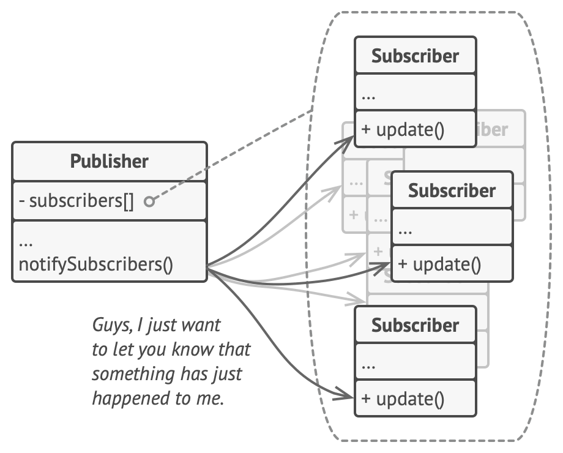

# Observables

### Ride or die!

---
Tom

---

- What we are covering (will do at the end)

---

<!-- class: invert -->

## Before we get started

---

<!-- class: default -->

### Why does this work?

```
import { filter, map } from 'rxjs/operators';
const squareOdd = of(1, 2, 3, 4, 5)
  .pipe(
    filter(n => n % 2 !== 0),
    map(n => n * n)
  );
// Subscribe to get values
squareOdd.subscribe(x => console.log(x));
```

---

#### Log

- 1
- 9
- 25

---

### A little clearer

```
import { filter, map } from 'rxjs/operators';

const numbSeq$ = of(1, 2, 3, 4, 5)

const squareOdd = numbSeq$.pipe(
    filter(n => n % 2 !== 0),
    map(n => n * n)
  );

squareOdd.subscribe(x => console.log(x));
```

---
Randy

---
<!-- class: invert -->

## WTF is an observable?

---

<!-- class: default -->

- Stream of data
- A value over time
- Handles async operations
- Stores the changing history of the object
- Subject of the `Observer pattern`

---

<!-- class: invert -->

## What problem are they trying to solve

---
<!-- class: default -->

- Your app change over time, in lots of different ways.
  - Data requests
  - Button clicks
  - Mouse movements
  - Time

- How do you manage that change?

---

It is a way of thinking about about problems. 

> This value will change over time by things that I do and don't have control over and that is cool. 

---

<!-- class: invert -->

## A Brief History

---

### Reactive programming

---

<!-- class: default -->

- Concerned with data streams and propagation of change
- `a = b + c ` doesn't mean just now, it means always. If `b` or `c` changes, so does `a`
- Reactive programming != Reactive system

---

#### Reactive Extensions (Rx)

- A framework to handle changes
- Pure operators
- Functional

---

##### As Microsoft explains it

Rx = Observables + LINQ + Schedulers

---

<!-- class: invert -->

### Observer pattern

---

<!-- class: default -->
> **Observer** is a behavioral design pattern that lets you define a subscription mechanism to notify multiple objects about any events that happen to the subject they’re observing.

---



---

It is similar to: Chain of Responsibility, Command and  Mediator

---

### Iterator Pattern

---

> *Iterator* is a behavioral design pattern that lets you traverse elements of a collection without exposing its underlying representation (list, stack, tree, etc.).

---
<!-- class: invert -->

## VS promises VS async/await

---

<!-- class: default -->
### Promises

> A object that acts as a proxy for a result that is initially unknown, usually because the computation of its value is not yet complete.

---

So if this value resolves, do this. <br>
If it changes, that is your problem.

---

### Async/wait 

Stop everything until this resovles, then do this. <br>
If it changes, that is your problem.
 
---

### Observables

This will have different values over time. That's cool, I'll handle it.

---

#### Also:

- You can cancel observables
- You can retry observables

---

#### _But_ observables work promises

`from(promise)` and `toPromise()`

---
<!-- class: invert -->
## RxJS and angular


---  

<!-- class: default -->

### There is no Angular without RxJS

---

- Routing
- Http
- EventEmitters
- Reactive forms

---
Tom

---
<!-- class: invert -->

## Patterns
---

<!-- class: default -->

`| async `

(soon to be ` | ngrxPush` and `ngrxLet`)

---

`untilDestroyed(this)`

---

`forkJoin/combineLatest/withLatestFrom`

---

`switchMap`

---

`scan`

---

`refreshIfRequired`

---

`mapTo`

---

`distinctUntilChanged`

---

`debounceTime/throttleTime`

---

`startWith`

---

`pairwise`

---

`iif`

---

<!-- class: invert -->

## Testing

---

<!-- class: default -->
### `Like and subscribe` Testing

---
### Marble testing
---

 

---
 ```
  it('Should merge two hot observables and start emitting from the subscription point', () => {
  	const e1 = hot('----a--^--b-------c--|', {a: 0});
  	const e2 = hot('  ---d-^--e---------f-----|', {a: 0});
  	const expected = cold('---(be)----c-f-----|', {a: 0});

  	expect(e1.pipe(merge(e2))).toBeObservable(expected);
  });
  ```
---

```
  - `-` time: 10 "frames" of time passage.
  - `|` complete: The successful completion of an observable.
  - `#` error: An error terminating the observable.
  - `"a" any character`: All other characters represent a value being emitted by the producer signaling next().
  - `()` sync groupings: When multiple events need to be in the same frame synchronously, parentheses are used to group those events. You can group nested values, a completion or an error in this manner.
  - `^` subscription point: (hot observables only) shows the point at which the tested observables will be subscribed to the hot observable.
 ```
---


###### unsubscribing onDestroy or use async. Is there any good checks for memory leaks from unsubscribed observable(s)? @sergei

---

## Memory leaks

---

## Further Reading

---
- [Observer pattern](https://refactoring.guru/design-patterns/observer)

- [How to Create and Fix Memory Leaks With Chrome DevTools](https://medium.com/better-programming/build-me-an-angular-app-with-memory-leaks-please-36302184e658)
- [How to create a memory leak in Angular](https://medium.com/angular-in-depth/how-to-create-a-memory-leak-in-angular-4c583ad78b8b)
- [Memory leak github](https://github.com/Everduin94/memory-leaks-rxjs)
- [Testing RxJS with marbles](https://dev.to/aturingmachine/testing-rxjs-with-marbles-3112)
- [How I Write Marble Tests For RxJS Observables In Angular](https://www.mokkapps.de/blog/how-i-write-marble-tests-for-rxjs-observables-in-angular/)
- [Marble testing with RxJS testing utils](https://medium.com/@kevinkreuzer/marble-testing-with-rxjs-testing-utils-3ae36ac3346a)

---

- [Railway oriented programming](https://fsharpforfunandprofit.com/rop/)